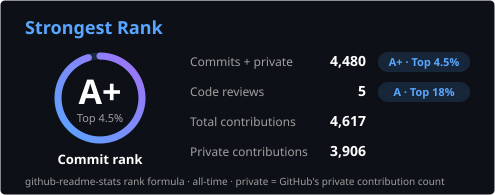
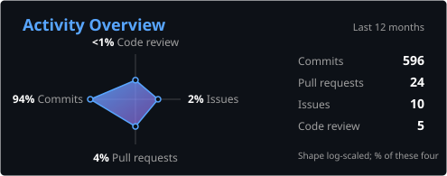
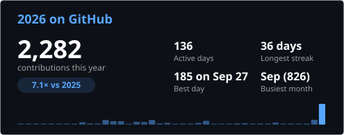
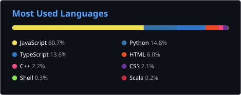

<!-- TYPING SVG HEADER -->

<!-- SOCIAL BADGES -->
 

 

---

## About Me

I build full-stack software applications and AI-powered systems, and I care deeply about clean architecture, great UX, and shipping things that actually work. Interested in AI/ML, research, software engineer/development (swe), AI Forward Deployed Engineer, AI Software Developer, UI/UX or product. I code everyday. 2026 multi-Hackathon Winner.

- **DeerHacks V Winner** with [LOCATR](https://github.com/Minifigures/LOCATR), a multi-agent location intelligence system
- **Hack the Globe 2026 Finalist** with [Canopy](https://hacktheglobe.vercel.app), a continuous remote care platform
- Built the [UTM Billiards Club website](https://utmbc.vercel.app) with Next.js, Elo rankings, AI chatbot, and a browser-based pool game
- Exploring automation (efficiency), multi-agent AI orchestration, cloud ML pipelines, developer tooling, agentic workflows, and LLM-powered systems

---

## Tech Stack

**Languages**

 

**Frameworks, Libraries & Backend**

 

**AI, Agents & LLM Tooling**

**Databases, Cloud & DevOps**

 

**Tools, IDEs & Design**

 

---

## Featured Projects

<table>
<tr>
<td width="50%" valign="top">

### Pandexis
**Epidemic Simulator with a RAG LLM Explainer**

*IBM x UNSA Two-Track Winner* | Team of 5

Vectorized SEIR plus Monte Carlo engine paired with a fault-tolerant RAG LLM explainer (IBM Granite, Claude, deterministic template fallback) on IBM Cloud. Won two tracks against 600+ participants from a 10,000+ applicant pool, backed by 104 automated tests on CI/CD.

`Python` `FastAPI` `IBM watsonx Granite` `RAG` `Next.js` `MapLibre`

</td>
<td width="50%" valign="top">

### [INN-SIGHT](https://github.com/Minifigures/hack_the_6ix)
**AI Feasibility Consultant for Short-Term Rentals**

*Hack the 6ix 2026 - MLH Best Use of Gemini API* | Team of 3

Drop a hotel or homestay onto a real Toronto parcel, stress-test it against five extreme-weather weekends, and get an investor-grade memo from a six-specialist Gemini agent briefing. Deterministic simulation over 63 source-linked benchmark constants and 60+ pytest cases. [Live demo](https://hack-the-6ix-tawny.vercel.app)

`Gemini` `FastAPI` `Next.js` `MapLibre` `Three.js` `MongoDB Atlas` `Auth0`

</td>
</tr>
<tr>
<td width="50%" valign="top">

### [LOCATR](https://github.com/Lushenwar/LOCATR)
**Agentic Spatial Intelligence Platform**

*DeerHacks V 2026 Winner* | Team of 4

Six LangGraph agents turn natural-language requests into a live Mapbox shortlist, streaming agent state over WebSockets. Asyncio fan-out cut pipeline latency from ~9s to under 3s; Auth0 CIBA gates real Gmail bookings behind a secure mobile push. 1 of 9 prizes across 164 participants.

`LangGraph` `FastAPI` `Next.js 14` `Snowflake` `Gemini 2.5` `Mapbox` `Auth0`

</td>
<td width="50%" valign="top">

### [Canopy](https://github.com/Minifigures/hacktheglobe)
**Continuous Remote-Care Platform**

*Hack the Globe 2026 - Health & Humanity Winner* | Team of 4

Remote care for elderly patients across three linked surfaces: a voice-AI "garden" check-in, a family dashboard, and a clinical dashboard with 0-100 risk stratification. A LangGraph pipeline turns daily signals into early-warning alerts. [Live demo](https://hacktheglobe.vercel.app)

`LangGraph` `FastAPI` `Groq` `Gemini` `Supabase` `Three.js` `Next.js 15` `Docker`

</td>
</tr>
<tr>
<td width="50%" valign="top">

### [UTM Billiards Club](https://utmbc.vercel.app)
**Full-Stack Club Platform**

Lead developer, club tech lead

Official site for a 320+ member club: Elo rankings, a tournament bracket generator, a TF-IDF FAQ chatbot, an in-browser 8-ball game with physics, and a Google-Sheets-backed pipeline so execs update rankings without touching code.

`Next.js 16` `TypeScript` `Tailwind v4` `React Three Fiber` `p5.js` `Google Sheets API`

</td>
<td width="50%" valign="top">

### [ClaimFlow](https://github.com/Minifigures/claimflow)
**Human-in-the-Loop AI Insurance Claims**

Solo engineer

Provider-pluggable LLM extraction (Claude with Gemini fallback), per-claimant ChromaDB RAG, and a fine-tuned EfficientNet-B0 imaging classifier at 94.2% accuracy (ECE 0.016) on 15,000 images. 253-test suite and a hash-chained audit log over every model call.

`Python` `FastAPI` `PyTorch` `ChromaDB` `Claude` `Next.js`

</td>
</tr>
<tr>
<td width="50%" valign="top">

### [VIGIL](https://github.com/Minifigures/genaihack)
**Multi-Agent Billing Fraud Detection**

Built at GenAI Genesis 2026 | Team of 4

A 14-agent LangGraph pipeline across five layers cross-checks uploaded dental receipts against the Ontario Dental Association fee guide and surfaces unused benefits. 21,000+ lines, 26 Playwright E2E tests, and a YAML-driven policy layer that keeps fraud scoring auditable.

`LangGraph` `IBM watsonx` `Gemini 2.0 Flash` `Supabase` `FastAPI` `Next.js 14`

</td>
<td width="50%" valign="top">

### [Portfolio](https://marcoayuste.com)
**Immersive React Three Fiber Portfolio**

Designer and developer (solo)

A procedural tropical beach that fades from golden hour into a starry night, with custom GLSL sky and ocean under a Liquid Glass interface. Lighthouse desktop: 99 Performance, 100 Accessibility, 100 SEO, with an adaptive quality ladder holding 60 fps at rest.

`Next.js 15` `React Three Fiber` `Three.js` `GLSL` `TypeScript` `Tailwind v4` `Framer Motion` `Zustand`

</td>
</tr>
</table>

---

## GitHub Stats

---

## Education

**University of Toronto**
Honours Bachelors Degree

**Philip Pocock Catholic Secondary School**
OSSD - Specialist High Skills Major: Computer Science | Extended French (Gr. 4-12)

---

### Let's Connect

I'm always open to interesting conversations, collaborations, and opportunities.

 

